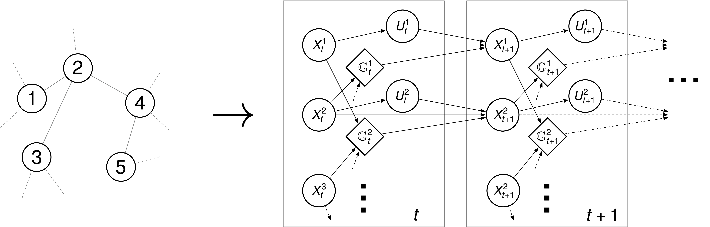
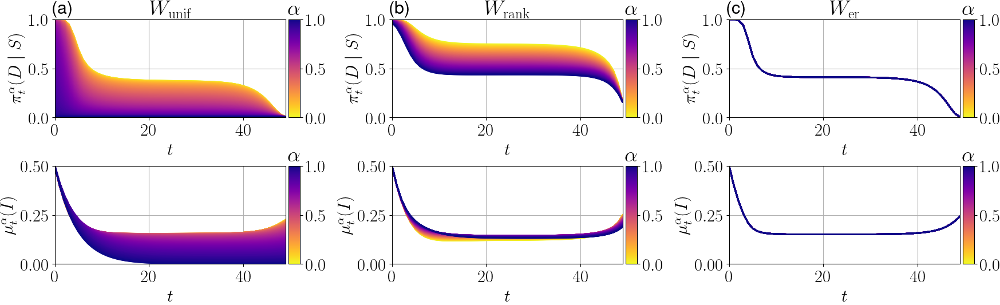
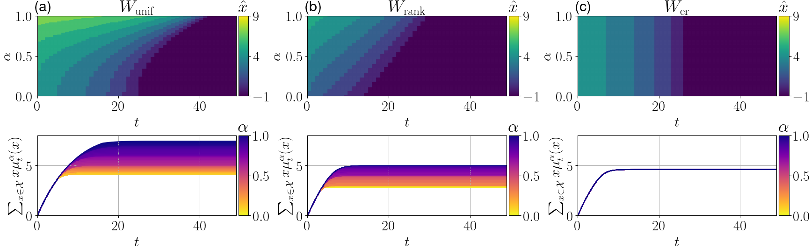

# Learning Graphon Mean Field Games

This repository is the official implementation of [Learning Graphon Mean Field Games and Approximate Nash Equilibria](https://arxiv.org/abs/2112.01280).



## Requirements

To install requirements:

```shell script
pip install -r requirements.txt
```

If needed, set PYTHONPATH to include the top-level folder, e.g.
```shell script
export PYTHONPATH=$PYTHONPATH:$(pwd)
```

## Training

To train in the mean field environment as in the paper, run the following commands:

```shell script
python ./experiments/run.py --game=<game_name> --solver=<solver_name> --eval_solver=<solver_name> --simulator=<sim_name> --evaluator=<eval_name> --iterations=<num_iters> --eta=<temperature> --graphon=<graphon_name>
```

For example, you can run the following command to run 250 fixed point iterations at temperature 0.6 via discretized solutions on the SIS-Graphon problem with uniform attachment graphon.

```shell script
python ./experiments/run.py --game=SIS-Graphon --solver=boltzmann --simulator=exact --evaluator=exact --iterations=250 --eta=0.6 --graphon=unif-att
```

For possible options, please see the associated help or ./experiments/args_parser.py

All results will be saved in corresponding folders in ./results/ with full logs.

## Evaluation

To evaluate learned GMFEs on the N-agent environment as in the paper, run this command:

```shell script
python ./experiments/run_once_nagent_compare.py --num_players_point=<num_players> --game=<game_name> --graphon=<graphon_name> --fixed_alphas=<0 or 1> --id=<seed>
```

To evaluate the approximate exploitability of the uniform prior policy, run this command:

```shell script
python ./experiments/run_uniform_exploitability.py 
```

All results will be saved in the corresponding experiment folders in ./results/ with full logs. 
(Except for PPO based on RLlib, which will by default save in the ray_results folder in your home directory.) 

For example, the resulting exploitabilities at iteration t could be plotted using the following code snippet:
```python
with open(args['experiment_directory'] + 'logs.pkl', 'rb') as f:
    result = pickle.load(f)
    mean_exploitability_t = result[t]['eval_opt']['eval_mean_returns'] - result[t]['eval_pi']['eval_mean_returns']
```

## Pre-trained Models

You can find pretrained GMFEs with experiment logs in the results folder. 
Note that due to space constraints (10+ GBs), we have only logged policy parameters for the last 3 fixed point iterations 
and excluded some experiment results.

## Results

Our model gives the following discretized policies:





To reproduce the plots after running the experiments, run the commands in the plots folder.
Note that some plots can be generated with the pretrained model as well.

For more details, see the paper.
